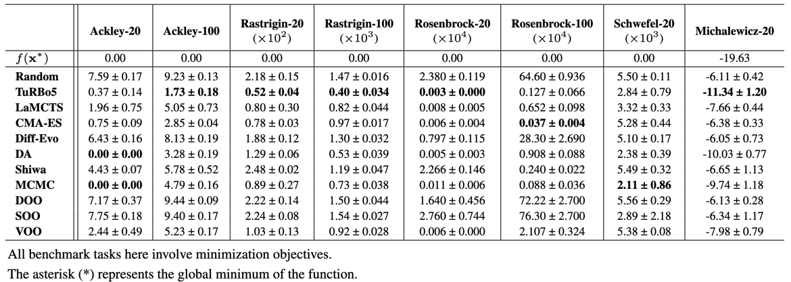

# BALSA: A Benchmark Suite for Active Learning in Scientific Discovery

`BALSA` is a comprehensive benchmark suite for evaluating active learning and optimisation algorithms in real-world scientific design tasks, with a focus on materials science and biology. The suite provides standardised implementations, metrics, and evaluation protocols to enable systematic comparison of different approaches.

<p align="center">
  
</p>

## Key Features

- **Real-world Scientific Tasks**: Includes challenging tasks from electron ptychography and protein design
- **Synthetic Benchmark Functions**: Standard test functions with known properties and varying difficulty
- **Standardised Evaluation**: Consistent protocols for fair algorithm comparison
- **Active Learning Framework**: Easy integration of new tasks and algorithms
- **Comprehensive Baselines**: Implementation of 10+ state-of-the-art optimisation methods

## Benchmark Results

### Parameter Optimisation: Electron Ptychography Reconstruction
Comparison of reconstructed phases (object transmission functions) obtained using different derivative-free optimisation methods on a MoS₂ dataset. Results demonstrate the relative performance of various approaches in this high-dimensional (14D) optimisation task.
<p align="center">
  
</p>

### Protein Design: Cyclic Peptide
Performance comparison of different optimisation strategies for designing cyclic peptide binders, showing the peptide sequences and corresponding protein interaction maps for target protein 4kel.
<p align="center">
  
</p>

### Synthetic Function Benchmarks
Quantitative comparison across standard test functions. Results show mean ± standard deviation over 5 independent trials.


## Installation

### Requirements
- Python ≥ 3.12
- CUDA-enabled GPU (recommended)
- TensorFlow and Keras with GPU support

### Basic Installation
```bash
pip install -e "git+https://github.com/poyentung/balsa.git"
```

### Full Installation with Optional Dependencies
```bash
# Core installation
git clone https://github.com/poyentung/balsa.git
cd balsa
pip install -e ./

# Optional: Install additional optimisation algorithms
git clone https://github.com/uber-research/TuRBO.git
pip install TuRBO/./

git clone https://github.com/facebookresearch/LaMCTS.git
pip install LaMCTS/LA-MCTS/./

# Optional: Install task-specific dependencies
pip install py4dstem  # For electron ptychography
```

## Usage Examples

### Real-world Task: Electron Ptychography
We run parameter optimization for electron ptychography using [TuRBO](vlab_bench/algorithms/_turbo.py) on a MoS2 dataset in <ins> **14 dimensions** </ins> for <ins> **20 samples** </ins> with <ins> **30 initial data points**</ins>. Note that `num_samples` should include the `init_samples` for [TuRBO](vlab_bench/algorithms/_turbo.py) and [LaMCTS](vlab_bench/algorithms/_lamcts.py), i.e., `num_samples=50` and `init_samples=30` represent 20 aquisition of samples (50 - 30 = 20). More detailed hyper-parameters can be adjusted in the [run_pytho.yaml](scripts/conf/run_ptycho.yaml).
```bash
python scripts/run_ptycho.py search_method=turbo \
                             obj_func_name=ptycho \
                             dims=14 \
                             num_acquisitions=10 \
                             num_samples_per_acquisition=5 \
                             num_init_samples=30
```

### Synthetic Benchmark: Multi-algorithm Comparison
```bash
python scripts/run.py -m search_method=mcmc,cmaes,da \
                         obj_func_name=ackley \
                         dims=10 \
                         num_acquisitions=10 \
                         num_samples_per_acquisition=20 \
                         num_init_samples=50
```

## Supported Tasks

### Real-world Scientific Tasks
- **Electron Ptychography**: 14-dimensional parameter optimisation for microscopy reconstruction
- **Cyclic Peptide Design**: Protein engineering for targeted binding

### Synthetic Benchmark Functions
- Ackley
- Rastrigin
- Rosenbrock
- Schwefel
- Michalewicz
- Griewank

## Implemented Algorithms
- [TuRBO](https://github.com/uber-research/TuRBO)
- [LaMCTS](https://github.com/facebookresearch/LaMCTS)
- [Dual Annealing](https://docs.scipy.org/doc/scipy/reference/generated/scipy.optimize.dual_annealing.html)
- [Differential Evolution](https://docs.scipy.org/doc/scipy/reference/generated/scipy.optimize.differential_evolution.html)
- [CMA-ES](https://github.com/CMA-ES/pycma)
- MCMC
- [DOO](https://github.com/beomjoonkim/voot)
- [SOO](https://github.com/beomjoonkim/voot)
- [VOO](https://github.com/beomjoonkim/voot)

## Contributing

We welcome contributions! Please submit a PR to:
- Add new scientific tasks
- Implement additional algorithms
- Improve documentation
- Fix bugs

## License

This project is licensed under the MIT License - see the [LICENSE](LICENSE) file for details.
